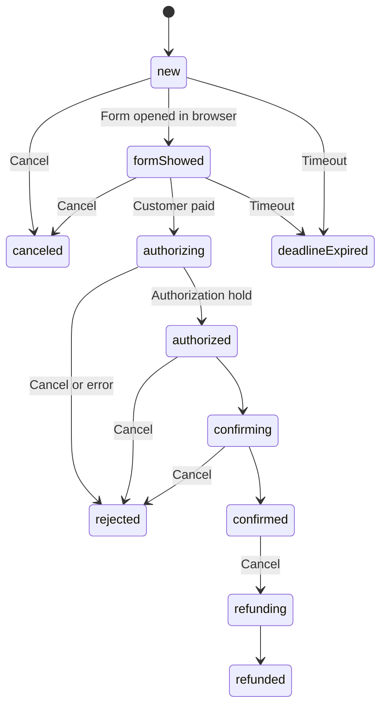

# librebread

Librebread is server for mock SMS sender services and smtp service for testing purposes. SmsRu and Devino telecom has beed imaplemended. Librebread is just random name

## Docker

https://hub.docker.com/r/vasyahuyasa/librebread

## Environment config

| Environment   | Default | Description  |
|---------------|---------|--------------|
| `DISABLE_TLS` | `0`     | DO not start HTTPS server on 403 port |
| `USER`        |         | Basic auth login, password must specified too |
| `PASSWORD`    |         | Basic auth password |

## API

### HTTP 80 port

#### URL params

`/?json=1` - JSON rsponse format

`/?limit=50` - Limit of messages, default `50`

| URL                    | DESCRIPTION    |
|------------------------|----------------|
| `/`                    | SMS messages   |
| `/helpdesk`            | Helpdesk eddy  |
| `/email`               | Email messages |

__LibreSMS__

| URL                | DESCRIPTION |
|--------------------|-------------|
| `/libre/send`      | send sms    |
| `/libre/check`     | not implemented |

### HTTPS 443 port

__DevinoTelecom__

| URL                    | DESCRIPTION |
|------------------------|-------------|
| `/rest/user/sessionid` |  always return session id MOCK-SESSION-ID |
| `/rest/sms/send`       | send sms |
| `/rest/sms/state`      | check account |

__SmsRU__

| URL                | DESCRIPTION |
|--------------------|-------------|
| `/sms/user/send`   | send sms    |
| `/sms/user/status` | messages status |

__LibreSMS__

| URL                | DESCRIPTION |
|--------------------|-------------|
| `/libre/send`      | send sms    |
| `/libre/check`     | not implemented |

__LibreCall__

| URL                | DESCRIPTION |
|--------------------|-------------|
| `/libre/flashcall` | init flashcall |

__TinkoffPayment__

| URL                 | DESCRIPTION |
|---------------------|-------------|
| `/tinkoff/init`     | creates payment |
| `/tinkoff/charge`   | performs autopay |
| `/tinkoff/getstate` | returns the current payment status |

__LibrePayment__

| URL                          | DESCRIPTION |
|------------------------------|-------------|
| `/libre/payment`             | creates payment |
| `/libre/payment/{id}`        | get payment info |
| `/libre/payment/{id}/confirm`| Confirm authorization hold, not implemented |
| ~~`/libre/payment/{id}/reject`~~ | Deprecated: Customer want cancel payment |
| `/libre/payment/{id}/pay` | Customer paid |
| `/libre/payment/{id}/cancel` | Customer want cancel or refund payment |
| `/libre/payment/{id}/status/new` | Force status to new  |
| `/libre/payment/{id}/status/formShowed` | Force status to formShowed  |
| `/libre/payment/{id}/status/deadlineExpired` | Force status to deadlineExpired  |
| `/libre/payment/{id}/status/canceled` | Force status to canceled  |
| `/libre/payment/{id}/status/authorizing` | Force status to authorizing  |
| `/libre/payment/{id}/status/authorized` | Force status to authorized  |
| `/libre/payment/{id}/status/confirming` | Force status to confirming  |
| `/libre/payment/{id}/status/rejected` | Force status to rejected  |
| `/libre/payment/{id}/status/confirmed` | Force status to confirmed  |
| `/libre/payment/{id}/status/refunding` | Force status to refunding  |
| `/libre/payment/{id}/status/refunded` | Force status to refunded  |

| Environment             | Description |
|-------------------------|-------------|
| `LIBREPAYMENT_BASE_URL` | Base url for generate payment link. Default `http://localhost` |

__LibreTelegram__
| URL                          | DESCRIPTION |
|------------------------------|-------------|
| `/telegram/{botToken}/{botMethod}`    | Telegram bot api request |

### LibrePayment payment state diagram

### SMTP 25 port

Plain SMTP server

### POP3 110 port

Mock of pop3 server
